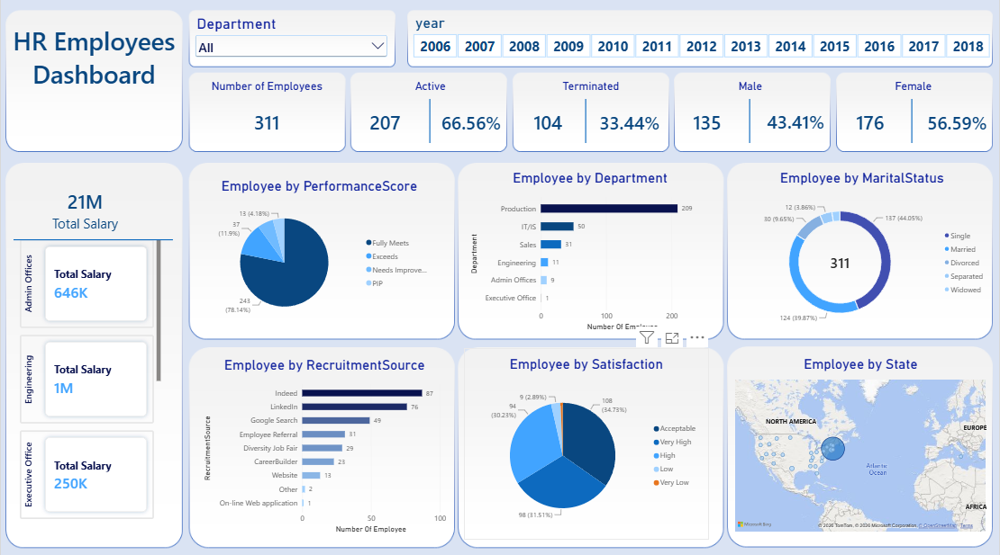

# HR Employees Dashboard

Interactive HR dashboard built with Power BI, Power Query and DAX, covering headcount, turnover, departments, recruitment sources, performance and salaries.

## Tools
- Power BI
- Power Query
- DAX

## Files
- `HR.pbix`: the Power BI report
- `HRData.csv`: the dataset

Note: the dataset is a sample used for practice.
